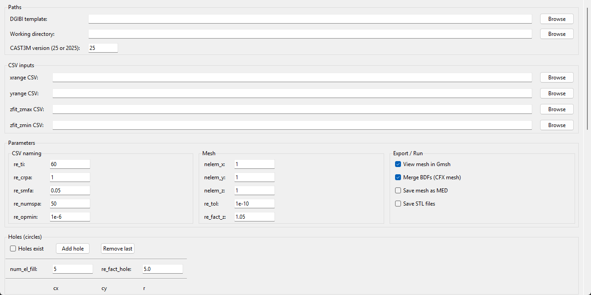
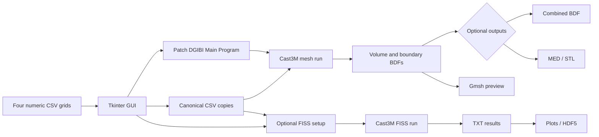
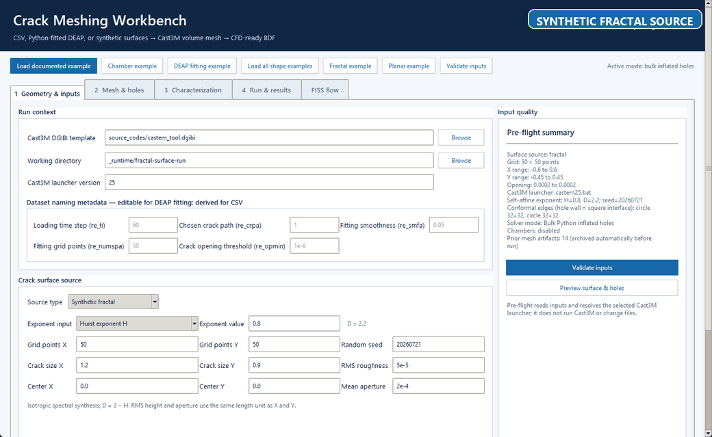
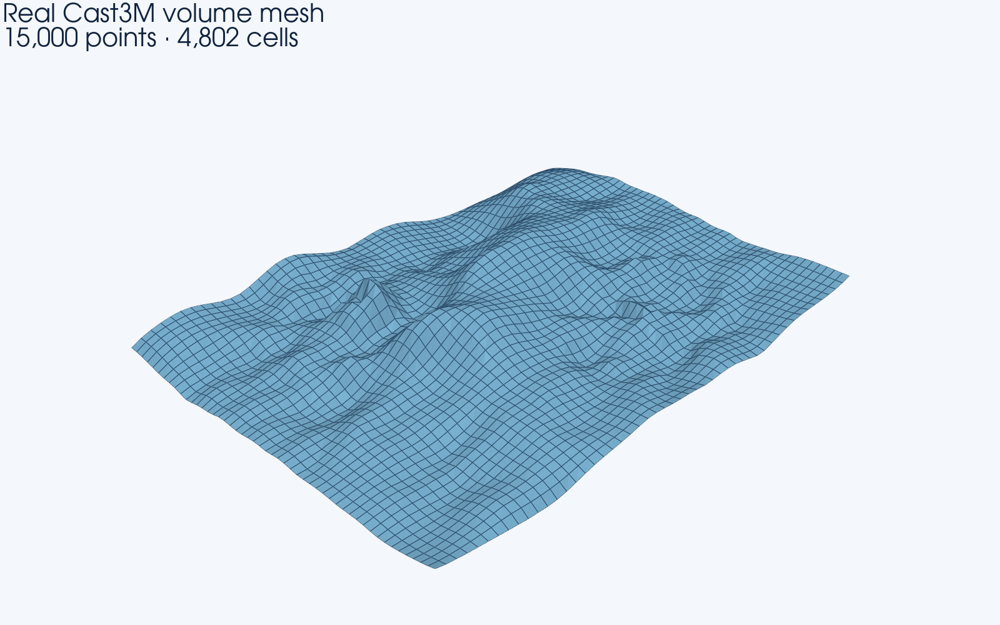
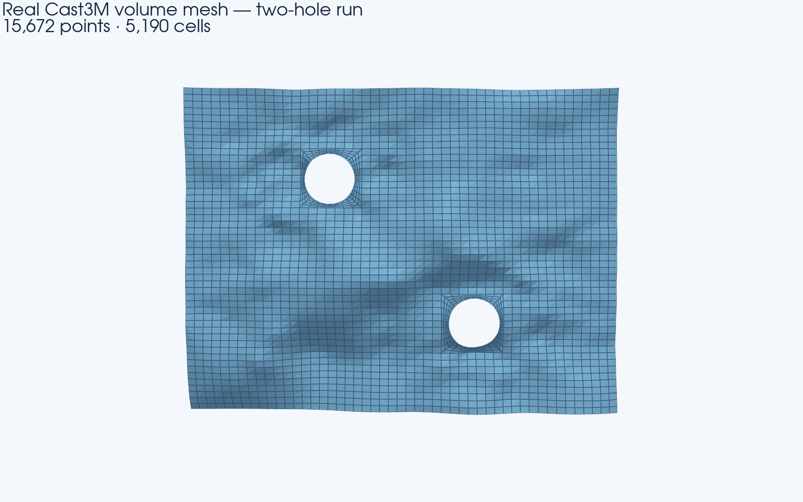

# DEM/CFD Crack Geometry to Mesh Converter

[](https://github.com/onajjar/dem-cfd-crack-geometry-to-mesh-converter/actions/workflows/ci.yml)

A Windows desktop pipeline that turns four structured crack-surface CSV grids into Cast3M meshes, prepares a combined NASTRAN BDF for downstream CFD import, and optionally evaluates crack flow with Cast3M's `FISS` operator.

> **Baseline status:** `v0.1.0-baseline` is a pre-refactor publication of the current T13 program. The GUI and every file in `source_codes/` are preserved byte-for-byte. Documentation, examples, verification, and CI are additive; computational behavior is intentionally unchanged.



## What it does

- Selects four comma-delimited surface grids: `xrange`, `yrange`, `zfit_zmax`, and `zfit_zmin`.
- Copies them to a working directory under the filenames expected by the Cast3M templates.
- Patches parameters only inside the marked `Main Program` section of a `.dgibi` template.
- Invokes Cast3M through its Windows batch launcher and streams solver output into the GUI.
- Creates a crack volume mesh and named boundary-surface meshes in NASTRAN BDF format.
- Supports zero, one, or multiple circular through-holes with per-hole center/radius inputs.
- Optionally exports MED/STL, combines volume and boundary BDF cards, and opens the selected mesh in Gmsh.
- Runs a separate, optional `FISS` flow calculation from the same four surface grids and post-processes solver text results into plots or HDF5.

## Workflow



The same diagram is available as a [PNG](docs/assets/workflow.png) and editable [Mermaid source](docs/workflow.mmd).

## Verified baseline executions

### No-hole example

The example was run on 2026-07-10 by driving the unchanged GUI path with Cast3M annual version 2025.0 (launcher version `25`), `nelem_x=1`, `nelem_y=1`, `nelem_z=1`, no holes, no MED/STL export, Gmsh launch disabled, and BDF merge enabled.



The animation is an authentic capture. The live log region is visibly replaced because the unchanged GUI prints local absolute paths there; the unredacted log is not published.

| Result | Recorded value |
|---|---:|
| Process return code | `0` |
| Cast3M error level | `0` |
| GUI-observed elapsed time | 10.774 s |
| Combined BDF size | 2,742,398 bytes |
| Combined BDF cards | 15,000 `GRID`; 4,802 `CHEXA`; 5,194 `CQUAD4`; 6 `PSHELL` |

Cast3M also emitted a signalling `IEEE_INVALID_FLAG` after its normal stop. The run proves that this host executed the pipeline and produced the recorded files; it does not establish numerical accuracy, mesh quality, or downstream CFD compatibility. The sanitized [run report](examples/output/run-report.json), generated DGIBI, and combined BDF are committed with checksums.



### Multiple-hole example

The same CSV quartet was also run through the unchanged GUI with two circular holes: `(-0.20, 0.20, 0.07)` and `(0.20, -0.20, 0.07)` as `(cx, cy, r)`. Cast3M returned `0`, stopped at error level `0`, exported two hole-surface BDFs, and the integrated merge produced a 2,917,106-byte combined BDF with 15,672 `GRID`, 5,190 `CHEXA`, 5,710 `CQUAD4`, and 8 `PSHELL` cards.



The two-hole run carried the same `IEEE_INVALID_FLAG` notice and the same validation boundary as the no-hole run. See the [multiple-hole guide](examples/multiple-holes/README.md) for exact GUI values, a machine-readable configuration, reproduction commands, published output checksums, and the sanitized run report.

## Requirements

| Component | Requirement | Purpose |
|---|---|---|
| Operating system | Windows | The baseline invokes `cmd.exe` and a Cast3M `.bat` launcher. |
| Python | 3.10 or newer, with Tkinter | The source uses Python 3.10 type syntax and a Tk desktop GUI. |
| Python packages | NumPy, Matplotlib | Required when the GUI module is imported. |
| HDF5 support | h5py | Needed for TXT-to-HDF5 FISS post-processing; the GUI otherwise treats it as optional. |
| Visual recreation | Pillow, meshio, PyVista/VTK | Optional; needed only to recapture documentation assets. |
| Cast3M | A compatible local installation | Required for mesh generation and `FISS`; not bundled here. |
| Gmsh | Optional local installation | Used only when opening a generated mesh for visualization. |

The audited development host used Python 3.13.5, Tk 8.6, NumPy 2.1.3, Matplotlib 3.10.0, h5py 3.12.1, Cast3M 25, and Gmsh 4.15.2. These versions describe the validated host, not a claim of exclusive compatibility.

## Installation

```powershell
git clone https://github.com/onajjar/dem-cfd-crack-geometry-to-mesh-converter.git
cd dem-cfd-crack-geometry-to-mesh-converter

py -3.11 -m venv .venv
.\.venv\Scripts\Activate.ps1
python -m pip install --upgrade pip
python -m pip install -r requirements.txt
```

To recreate the exact Python package versions used for the recorded baseline runs, install with the committed constraints:

```powershell
python -m pip install -r requirements.txt -c constraints-baseline.txt
```

Cast3M is resolved in this order:

1. `CASTEM_PATH`, pointing to either a `castem*.bat` file or a directory containing one.
2. The built-in Windows Cast3M installation layout derived from the version field (`25` and `2025` both select the version-25 launcher).

Gmsh is resolved from `GMSH_PATH`, standard Program Files locations, matching folders in the current user's home directory, or `PATH`.

Example environment overrides:

```powershell
$env:CASTEM_PATH = 'path\to\castem25.bat'
$env:GMSH_PATH = 'path\to\gmsh.exe'
```

## Quick start

Launch the application from the repository root so the existing icon is discoverable:

```powershell
python castem_pipeline_gui_t13.py
```

Then:

1. Choose `source_codes\castem_tool.dgibi` as the mesh template.
2. Choose a fresh working directory. Generated meshes can be large and existing names may be replaced.
3. Select the four files in `examples\input` in their matching `xrange`, `yrange`, `zfit_zmax`, and `zfit_zmin` fields.
4. Keep the example naming parameters at `re_ti=60`, `re_crpa=1`, `re_smfa=0.05`, `re_numspa=50`, and `re_opmin=1e-6`.
5. Review mesh density, hole, export, merge, and Gmsh options. The example walkthrough uses `nelem_x=1`, `nelem_y=1`, `nelem_z=1`, and no holes.
6. Select **Run converter** and monitor the log.

See [examples/README.md](examples/README.md) for the shared input/output policy, and [examples/multiple-holes/README.md](examples/multiple-holes/README.md) for the two-hole walkthrough.

## CSV input contract

Each input is a headerless, comma-delimited numeric matrix. The four matrices must have the same rectangular shape and at least two rows and two columns.

| Input | Meaning at grid index `(i, j)` |
|---|---|
| `xrange` | x coordinate |
| `yrange` | y coordinate |
| `zfit_zmax` | upper crack-surface z coordinate |
| `zfit_zmin` | lower crack-surface z coordinate |

The Cast3M templates derive:

```text
mean surface = (zfit_zmax + zfit_zmin) / 2
opening      =  zfit_zmax - zfit_zmin
```

Use decimal points, finite values, compatible coordinate grids, and `zfit_zmax >= zfit_zmin`. The GUI checks that files exist but does not validate matrix shape, contents, or physical consistency before starting Cast3M.

The unchanged post-processing converts x/y/z coordinates to centimetres and opening to micrometres for plots, so it implicitly treats the CSV coordinate values as metres.

The selected source filenames may be arbitrary. Before execution, the GUI copies them to names of this form:

```text
xrange_ti{ti}_crpa{crpa}_smfa{smfa_int}_numsp{numspa}_opmin{opmin_int}.csv
yrange_ti{ti}_crpa{crpa}_smfa{smfa_int}_numsp{numspa}_opmin{opmin_int}.csv
zfit_zmax_ti{ti}_crpa{crpa}_smfa{smfa_int}_numsp{numspa}_opmin{opmin_int}.csv
zfit_zmin_ti{ti}_crpa{crpa}_smfa{smfa_int}_numsp{numspa}_opmin{opmin_int}.csv
```

Here `smfa_int = round(re_smfa * 100)` and `opmin_int = round(re_opmin * 1e6)` in Python. Use values whose scaled forms are exact integers; the unchanged Cast3M templates use `ENTI`, which can otherwise disagree with Python rounding.

## Mesh outputs

With the supplied mesh template, a successful run writes:

| Output | Description |
|---|---|
| `castem_mesh_v.bdf` | Volume mesh. |
| `castem_mesh_surf_min.bdf`, `castem_mesh_surf_max.bdf` | Lower and upper crack surfaces. |
| `castem_mesh_surf_mean.bdf` | Mean surface; intentionally excluded from the integrated merge. |
| `castem_mesh_surf_xmin.bdf`, `..._xmax.bdf`, `..._ymin.bdf`, `..._ymax.bdf` | Side boundaries. |
| `castem_mesh_surf_trou_{n}.bdf` | One boundary per configured circular hole. |
| `combined_ti...bdf` | Optional merged volume and boundary BDF. |
| `castem_mesh_v.med` | Optional MED volume mesh. |
| `castem_mesh_surf_*.stl` | Optional triangulated surface exports. |

The combined file is a NASTRAN BDF assembled by the GUI's `merge_bdfs()` function. It is intended to simplify downstream CFD import, but this baseline does not automate or validate import into Ansys CFX and does not perform mesh-quality checks.

## Optional FISS flow calculation

The **Calcul (FISS)** path is a separate Cast3M run over the same CSV geometry; it does not consume the merged BDF. Choose `source_codes\fuite_fissure.dgibi` as its template.

The unchanged GUI exposes:

- Flow/friction models `POISEU_BLASIUS`, `POISEU_COLEBROOK`, `POISEU_GELAIN_2008`, `POISEU_GELAIN_2012`, `POISEU_RIZKALLA`, and `FROTTEMENT1` through `FROTTEMENT4`.
- Perfect (`PARF`) or real (`REEL`) gas choices.
- Mass (`MASS`) or film (`FILM`) condensation choices.
- Single values or ranges for upstream total pressure and inlet temperature.
- Downstream pressure, upstream steam pressure, wall temperature, line subdivision, and model-dependent material inputs.

The template builds lines through the crack, derives local opening and extent, and calls the Cast3M `FISS` operator. It exports geometry series and the fields `P`, `PV`, `TF`, `X`, `U`, `H`, `Q`, `QA`, `QE`, `RE`, and `F`. The GUI can read the semicolon-delimited text results, create `results.h5` when h5py is installed, and export plots.

`source_codes/fiss.eso` is operator source; the GUI does not compile or install it. The active Cast3M installation must already provide a compatible `FISS` operator.

## Repository layout

```text
.
├── castem_pipeline_gui_t13.py   # unchanged baseline GUI
├── bpm_cfx.ico                  # unchanged GUI icon
├── source_codes/                # unchanged Cast3M and helper sources
├── examples/
│   ├── input/                   # existing 50 × 50 CSV quartet
│   ├── output/                  # verified no-hole run artifacts
│   └── multiple-holes/          # verified two-hole configuration/output
├── docs/
│   ├── assets/                  # authentic screenshots and diagrams
│   ├── source-audit.md
│   └── workflow.mmd
├── scripts/                     # baseline verification and visual tooling
├── tests/                       # non-invasive structural/hash tests
└── .github/workflows/ci.yml
```

## Reproducibility checks

Verify the immutable baseline files against the committed SHA-256 manifest:

```powershell
python scripts\verify_baseline.py
```

Run the non-invasive checks used by CI:

```powershell
python -m pip install -r requirements-dev.txt -c constraints-baseline.txt
python -m compileall -q .
python -m pytest -q
```

These checks validate source preservation and Python syntax. They do not replace a licensed Cast3M execution or numerical validation.

### Rebuild documentation visuals

The visual tools are intentionally separate from the GUI runtime dependencies:

```powershell
python -m pip install -r requirements-visuals.txt -c constraints-baseline.txt
python scripts\render_workflow.py
```

On a Windows desktop with Cast3M available, `python scripts\capture_demo.py` drives the unchanged GUI run and recreates the GUI screenshot/GIF in a fresh ignored runtime directory. After a successful run, `python scripts\render_mesh.py` recreates the mesh preview from the real volume BDF. The multiple-hole guide provides its exact runner and render command.

## Limitations and known baseline behavior

- This is an intentionally unrefactored Windows baseline; there is no headless CLI or packaging layer.
- Cast3M and Gmsh are external applications and are not installed by `requirements.txt`.
- CSV schema and physical consistency are not validated by the GUI before solver execution.
- The integrated BDF merger imports `CQUAD4` boundary cards, assigns one `PSHELL` per surface file, and excludes the mean surface. It is not a general-purpose BDF merger.
- **FISS model parameters:** the patcher replaces only the first matching assignment in the template's Main Program. Because the supplied FISS template repeats material variables in multiple model blocks, some entered overrides can affect an earlier inactive block while the selected model retains a hard-coded value. This behavior is preserved and must be verified in the generated `.dgibi` before relying on a study.
- Enabling **View mesh in Gmsh** also writes `opti_visu=1`; the supplied Cast3M template performs its own `TRAC` operation before the GUI opens Gmsh.
- FISS post-processing moves converted text files into a timestamped quarantine directory. Keep the original run directory if raw results matter.
- Solver meshes and flow results can grow from megabytes to many gigabytes. Generated outputs are ignored by default and should be archived outside Git unless deliberately reviewed.
- The standalone `source_codes/merge_surface_bdf.py` is retained for provenance but differs from the merger embedded in the GUI.

## Troubleshooting

**Cast3M executable not found**

Set `CASTEM_PATH` to the batch file or its containing directory, or enter a version matching the default Cast3M installation layout.

**Gmsh executable not found**

Uncheck **View mesh in Gmsh**, or set `GMSH_PATH` to the executable or its directory. Mesh generation does not require Gmsh.

**Tkinter import error**

Install a Python distribution that includes Tcl/Tk. Tkinter is normally included with the standard Windows Python installer.

**Cast3M cannot find a CSV**

Confirm all four naming parameters match the example and use exactly scaled `re_smfa`/`re_opmin` values. Inspect the copied filenames in the working directory.

**HDF5 conversion is unavailable**

Install the full runtime requirements with `python -m pip install -r requirements.txt`; h5py is needed for that post-processing path.

**Unexpectedly large output**

Use a fresh work directory and start with conservative `nelem_x`, `nelem_y`, and `nelem_z` values. Do not add generated BDF, MED, STL, HDF5, or solver text trees to Git by default.

## Project status, provenance, and licensing

This release is a preservation point for future testing and refactoring. See [CHANGELOG.md](CHANGELOG.md), [the source audit](docs/source-audit.md), and [CONTRIBUTING.md](CONTRIBUTING.md).

No `LICENSE` file was present in the supplied project, so none has been added. Public source visibility alone does not grant reuse, modification, or redistribution rights. The provenance and redistribution terms of `source_codes/fiss.eso` should also be confirmed before describing this repository as open source.

Please report security concerns through the process in [SECURITY.md](SECURITY.md).
