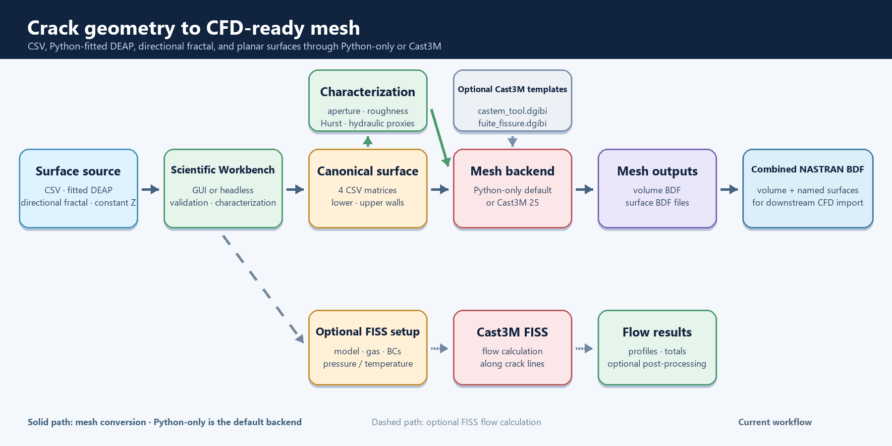

# DEM Crack Surface Mesher

Research software for reconstructing and characterizing three-dimensional
crack surfaces from discrete-element (DEM) data, generating CFD-ready meshes,
and preparing NASTRAN BDF models for leakage and flow studies.

[](https://github.com/onajjar/dem-crack-surface-mesher/tree/windows)
[](https://github.com/onajjar/dem-crack-surface-mesher/tree/linux)
[](https://www.python.org/)
[](https://doi.org/10.1016/j.nucengdes.2025.114718)

> **Choose a platform branch before cloning.** The default `main` branch is
> the project landing page; the complete applications, examples, tests, and
> technical documentation are maintained in the platform branches below.

## Choose your platform

| Distribution | Branch | Intended use | Documentation |
|---|---|---|---|
| **Windows** | [`windows`](https://github.com/onajjar/dem-crack-surface-mesher/tree/windows) | Windows desktop and headless workflows with the preserved Cast3M baseline | [Windows README](https://github.com/onajjar/dem-crack-surface-mesher/blob/windows/README.md) |
| **Linux** | [`linux`](https://github.com/onajjar/dem-crack-surface-mesher/tree/linux) | Native Linux setup and launchers for desktop or headless execution | [Linux README](https://github.com/onajjar/dem-crack-surface-mesher/blob/linux/README.md) · [Linux guide](https://github.com/onajjar/dem-crack-surface-mesher/blob/linux/docs/linux.md) |

Both distributions preserve the immutable historical T13 runtime files. The
Linux port adds native process and executable discovery without rewriting that
scientific baseline.

[](docs/assets/scientific-workbench.png)

## Quick start

### Windows

```powershell
git clone --branch windows --single-branch https://github.com/onajjar/dem-crack-surface-mesher.git converter-windows
cd converter-windows
py -3 -m venv .venv
.\.venv\Scripts\Activate.ps1
python -m pip install --upgrade pip
python -m pip install -r requirements.txt -c constraints-baseline.txt
python castem_pipeline_gui_scientific.py
```

### Linux

```bash
git clone --branch linux --single-branch https://github.com/onajjar/dem-crack-surface-mesher.git converter-linux
cd converter-linux
./scripts/setup_linux.sh
./run_linux.sh
```

Cast3M and Gmsh are external applications and are not installed by the Python
requirements. The source-free Python meshing backend remains available when
Cast3M is not installed. Git LFS is required to download the larger bundled
DEAP example datasets.

## Main capabilities

- Load existing crack-surface CSV matrices or fit raw DEAP HDF5 results with a
  MATLAB-compatible Python quadratic LOESS reconstruction.
- Generate reproducible constant or directional fractal crack surfaces.
- Characterize aperture, tortuosity, roughness, Hurst scaling, orientation,
  connectivity, and hydraulic proxies.
- Generate structured HEXA8 crack meshes with Cast3M or the source-free Python
  backend.
- Model circular and shaped through-holes, inlet/outlet chambers, and graded
  mesh regions.
- Export NASTRAN BDF, MED, and STL data for downstream CFD workflows.
- Optionally evaluate crack flow with Cast3M's `FISS` operator.

## Scientific workflow

[](docs/assets/workflow.png)

The solid path covers mesh conversion with the Python-only default or Cast3M;
the dashed path covers the optional FISS flow calculation.

## Citation

If this software or its reconstruction workflow contributes to research or a
publication, please cite:

> O. Najjar, T. Heitz, C. Oliver-Leblond, J.-L. Tailhan, G. Rastiello, and
> F. Ragueneau, “Three-dimensional crack reconstruction from Beam–Particle
> Model for CFD-based leakage assessment,” *Nuclear Engineering and Design*,
> vol. 448, article 114718, 2026.
> [https://doi.org/10.1016/j.nucengdes.2025.114718](https://doi.org/10.1016/j.nucengdes.2025.114718)

Each platform branch contains `CITATION.cff` and `CITATION.bib` metadata for
reference managers and automated citation tools.

## Repository policy

- `main` is the public project landing page and platform selector.
- `windows` contains the maintained Windows distribution.
- `linux` contains the native Linux distribution.
- Generated solver, mesh, and characterization outputs stay outside Git unless
  they are deliberately reviewed examples.
- The files listed in `BASELINE_SHA256SUMS` remain byte-for-byte protected in
  the implementation branches.

Contribution and security guidance are available in the maintained source
branches: [Contributing](https://github.com/onajjar/dem-crack-surface-mesher/blob/linux/CONTRIBUTING.md),
[Code of Conduct](https://github.com/onajjar/dem-crack-surface-mesher/blob/linux/CODE_OF_CONDUCT.md),
and [Security](https://github.com/onajjar/dem-crack-surface-mesher/blob/linux/SECURITY.md).
