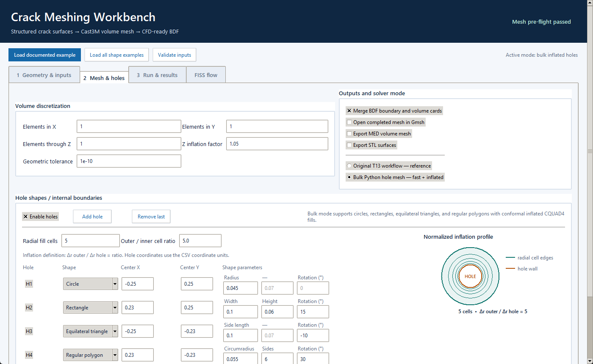
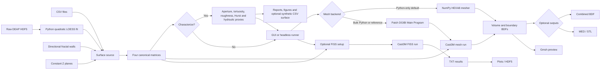
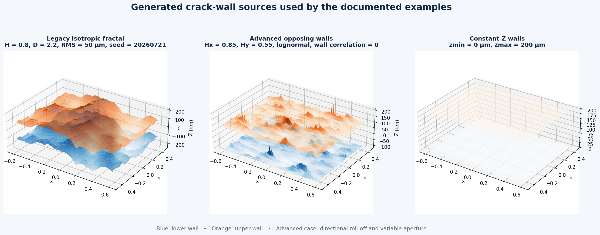
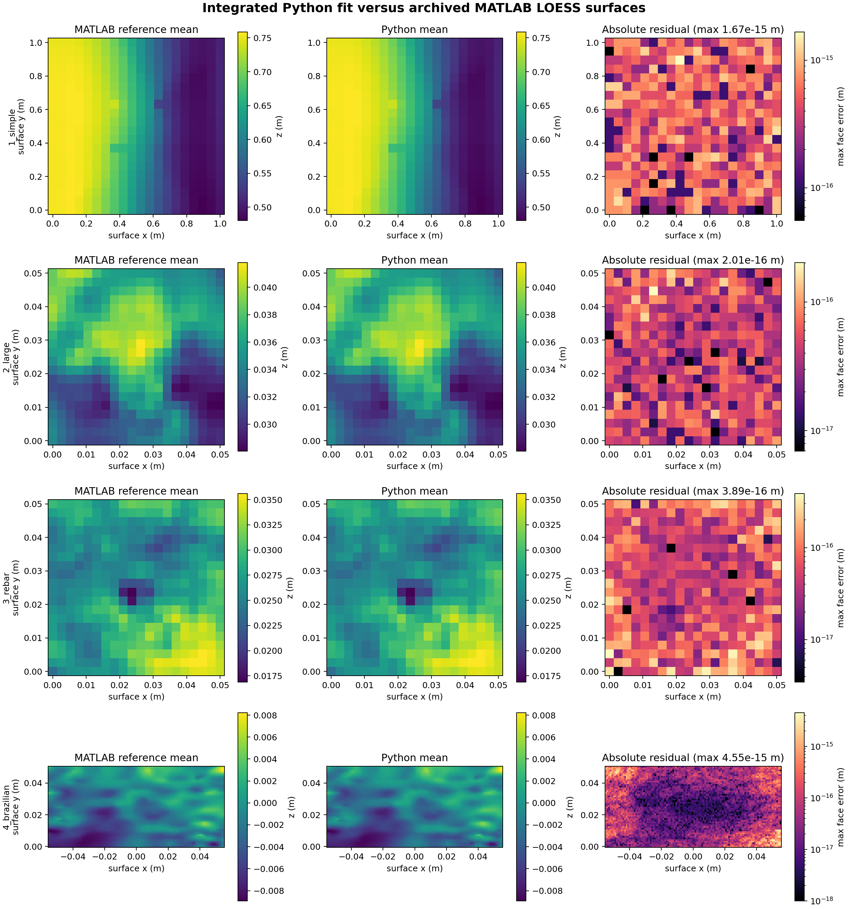
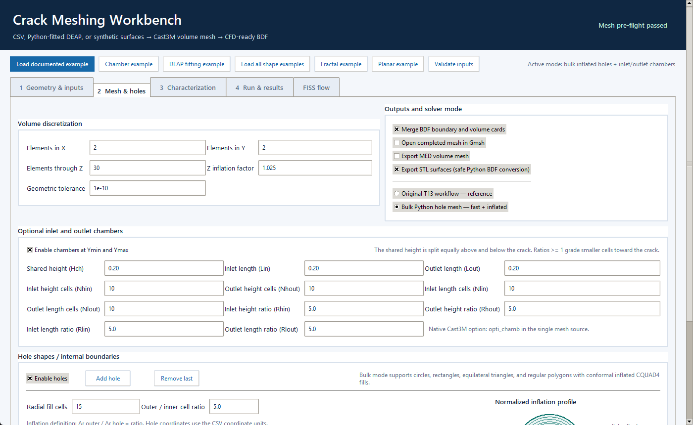
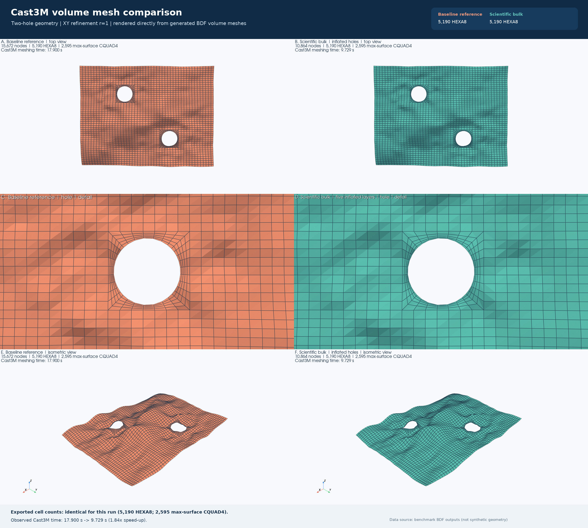
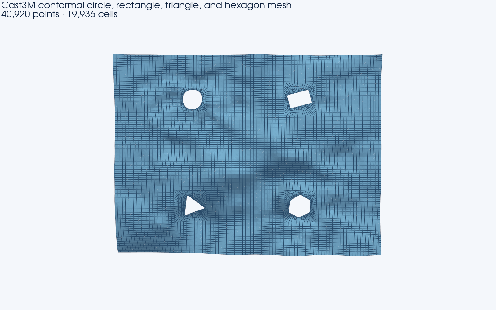
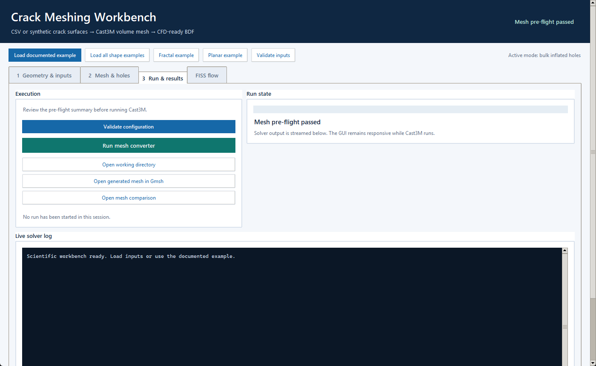

# DEM Crack Surface Mesher

[](https://github.com/onajjar/dem-crack-surface-mesher/actions/workflows/ci.yml?query=branch%3Awindows)

A Windows desktop pipeline that loads CSVs, fits raw DEAP discrete-simulation
results in Python, or synthesizes structured crack surfaces; optionally
characterizes aperture, geometrical tortuosity, roughness, Hurst scaling,
additive wavelet scales, orientation, connectivity, and cubic-law hydraulic
proxies; converts the same
surface into Cast3M meshes; prepares a combined NASTRAN BDF for downstream CFD
import; and optionally evaluates crack flow with Cast3M's `FISS` operator.

> **Baseline status:** `v0.1.0-baseline` preserves the historical T13 program.
> `castem_pipeline_gui_t13.py` and the files listed in `BASELINE_SHA256SUMS`
> remain byte-for-byte protected; current additions are isolated in the
> scientific launcher, supporting modules, and explicitly additive sources.

## Citation

If this software or its crack-reconstruction workflow contributes to research,
analysis, or a publication, please cite the scientific article that introduces
the methodology:

> O. Najjar, T. Heitz, C. Oliver-Leblond, J.-L. Tailhan, G. Rastiello, and
> F. Ragueneau, “Three-dimensional crack reconstruction from Beam–Particle
> Model for CFD-based leakage assessment,” *Nuclear Engineering and Design*,
> vol. 448, article 114718, 2026.
> [https://doi.org/10.1016/j.nucengdes.2025.114718](https://doi.org/10.1016/j.nucengdes.2025.114718)

For the beam-particle/discrete-element formulation underlying the DEM
microcracking simulations, also cite:

> M. Vassaux, C. Oliver-Leblond, B. Richard, and F. Ragueneau,
> “Beam-particle approach to model cracking and energy dissipation in concrete:
> Identification strategy and validation,” *Cement and Concrete Composites*,
> vol. 70, pp. 1–14, 2016.
> [https://doi.org/10.1016/j.cemconcomp.2016.03.011](https://doi.org/10.1016/j.cemconcomp.2016.03.011)

GitHub-compatible citation metadata are provided in
[`CITATION.cff`](CITATION.cff), and ready-to-use BibTeX entries are available in
[`CITATION.bib`](CITATION.bib).



## What it does

- Selects an existing four-CSV dataset, reconstructs a DEAP crack surface with
  the MATLAB-compatible Python quadratic LOESS fit, synthesizes legacy or
  directional/non-Gaussian opposing fractal walls, or creates two constant-Z
  planes.
- Materializes every source as the same canonical `xrange`, `yrange`, `zfit_zmax`, and `zfit_zmin` matrices expected by the preserved Cast3M templates.
- Optionally characterizes the reconstructed surface before meshing—or without
  meshing—and exports reproducible statistics, diagnostics, reports, and
  statistically representative synthetic realizations.
- Patches parameters only inside the marked `Main Program` section of a `.dgibi` template.
- Invokes Cast3M through its Windows batch launcher and streams solver output into the GUI.
- Creates a crack volume mesh and named boundary-surface meshes in NASTRAN BDF format.
- Supports zero, one, or multiple through-holes. The scientific mode accepts circles, rotated rectangles, rotated equilateral triangles, and regular polygons with any integer side count ≥ 3.
- Optionally exports MED/STL, combines volume and boundary BDF cards, and opens the selected mesh in Gmsh.
- Runs a separate, optional `FISS` flow calculation from the same canonical surface grids and post-processes solver text results into plots or HDF5.

## Workflow



The same diagram is available as a [PNG](docs/assets/workflow.png) and editable [Mermaid source](docs/workflow.mmd).

## Surface source modes

The scientific launcher changes its visible inputs with the selected source:

| Source | Required geometry inputs | Z definition |
|---|---|---|
| Existing CSV | Four equally shaped matrices | Values supplied by the dataset |
| Raw DEAP results | `deap_post.h5`, `deap_output.h5`, fit parameters, and boundary | Python-fitted lower and upper crack faces |
| Synthetic fractal | Grid/extent, X/Y exponents and roll-off, wall RMS/correlation, marginal distribution, aperture bounds, seed | Correlated or independent opposing walls with variable aperture |
| Constant Z planes | Grid points, X/Y size and center, lower Z, upper Z | No fluctuations |

For a two-dimensional surface graph embedded in three dimensions, the
implemented relation is `D = 3 - H`, with `0 < H < 1` and `2 < D < 3`.
Equal X/Y exponents, equal wall RMS values, Gaussian heights, correlation one,
and blank roll-off wavelengths retain the original parallel-wall result
byte-for-byte. Directional exponents, paired roll-off wavelengths,
Gaussian/uniform/Laplace/lognormal marginals, and wall correlation extend the
model to anisotropic independently rough walls. The seed makes every
realization reproducible, while the report records achieved statistics.

An exponent defines scale dependence, not vertical magnitude, so RMS height cannot be inferred from `H` or `D`. Likewise, a positive aperture is required for Cast3M volume meshing. In constant mode the lower wall may be `z = 0` everywhere, but the upper wall must be greater than the lower wall.



The committed examples were executed with Cast3M 25 and the same circle/rectangle hole configuration:

| Source | Cast3M elapsed | Surface quads | Volume HEXA8 | Hole interfaces | Residual seams |
|---|---:|---:|---:|---|---:|
| Fractal, `H=0.8` (`D=2.2`) | 15.075 s | 2,590 | 5,180 | `28=28`, `32=32` | 0 |
| Constant, `zmin=0`, `zmax=2e-4` | 10.364 s | 2,590 | 5,180 | `28=28`, `32=32` | 0 |

All 5,180 HEXA8 elements and all 41,440 evaluated element corners in each real BDF had consistent positive, non-zero Jacobians. Cast3M returned `0` at error level `0` and also emitted its existing signalling `IEEE_INVALID_FLAG` notice. These checks establish execution and interface topology, not full integration-point quality or CFD suitability.

```powershell
python castem_pipeline_gui_scientific.py --headless examples\surfaces\fractal-hurst.ini
python castem_pipeline_gui_scientific.py --headless examples\surfaces\fractal-advanced.ini
python castem_pipeline_gui_scientific.py --headless examples\surfaces\constant-planes.ini
```

See [Structured surface generation](docs/surface-generation.md) for the spectral model, wall construction, units, reproducibility contract, and limitations.

### MATLAB-free DEAP fitting

For each application, select either `deap` to fit raw discrete-simulation HDF5 results in Python or `csv` to bypass fitting and use an existing quartet. The four bundled DEAP applications reproduce every archived MATLAB grid and face value within `1e-12 m`; the maximum observed face error is `4.55e-15 m`. See [Python DEAP crack-surface fitting](docs/deap-surface-fitting.md), the [four runnable application packages](examples/deap/README.md), and the [machine-readable integrated validation report](docs/validation/deap-surface-report.json).

The `1_simple` case was additionally meshed end to end with Cast3M 2025.0 in both modes. Both completed at error level `0` with no missing outputs and produced byte-identical combined BDFs; Gmsh 4.15.0 accepted that BDF with a headless `-check`. The sanitized [integration report](docs/validation/deap-simple-castem-integration.json) records commands, timings, SHA-256, byte size, card counts, and Gmsh return code.



## Verified baseline executions

### No-hole example

The example was run on 2026-07-10 by driving the unchanged GUI path with Cast3M annual version 2025.0 (launcher version `25`), `nelem_x=1`, `nelem_y=1`, `nelem_z=1`, no holes, no MED/STL export, Gmsh launch disabled, and BDF merge enabled.

| Result | Recorded value |
|---|---:|
| Process return code | `0` |
| Cast3M error level | `0` |
| GUI-observed elapsed time | 10.774 s |
| Combined BDF size | 2,742,398 bytes |
| Combined BDF cards | 15,000 `GRID`; 4,802 `CHEXA`; 5,194 `CQUAD4`; 6 `PSHELL` |

Cast3M also emitted a signalling `IEEE_INVALID_FLAG` after its normal stop. The run proves that this host executed the pipeline and produced the recorded files; it does not establish numerical accuracy, mesh quality, or downstream CFD compatibility. The sanitized [run report](examples/output/run-report.json), generated DGIBI, and combined BDF are committed with checksums.


### Multiple-hole example

The same CSV quartet was also run through the unchanged GUI with two circular holes: `(-0.20, 0.20, 0.07)` and `(0.20, -0.20, 0.07)` as `(cx, cy, r)`. Cast3M returned `0`, stopped at error level `0`, exported two hole-surface BDFs, and the integrated merge produced a 2,917,106-byte combined BDF with 15,672 `GRID`, 5,190 `CHEXA`, 5,710 `CQUAD4`, and 8 `PSHELL` cards.


The two-hole run carried the same `IEEE_INVALID_FLAG` notice and the same validation boundary as the no-hole run. See the [multiple-hole guide](examples/multiple-holes/README.md) for exact GUI values, a machine-readable configuration, reproduction commands, published output checksums, and the sanitized run report.

### Scientific launcher and accelerated hole path

`castem_pipeline_gui_scientific.py` is the single launcher for the enhanced
workflow. It keeps the historical T13 GUI unchanged while offering the
original reference mode, the fast bulk Python-hole + Cast3M mode, and a
source-free Python-only HEXA8 mode. Optional inlet/outlet chambers are
available from the same interface.

```powershell
python castem_pipeline_gui_scientific.py
```

Select **Python-only HEXA8 — no DGIBI, Cast3M, or Gmsh** to construct the
complete volume directly in NumPy. This mode preserves the structured
`elements_x`, `elements_y`, and `elements_z` controls, Cast3M-equivalent
endpoint-density grading through Z, conformal inflated holes, all chamber
dimensions/counts/ratios, named BDF boundaries, safe STL conversion, optional
MED output, and BDF merging. It always writes `python_mesh_preview.png` instead
of requiring an external viewer.

The documented source-free chamber case runs without either source-file entry:

```powershell
python.exe .\castem_pipeline_gui_scientific.py --headless `
  .\examples\python-only-chambers\run.ini --validate-only
python.exe .\castem_pipeline_gui_scientific.py --headless `
  .\examples\python-only-chambers\run.ini
```

Numbering-independent validation against the reviewed Cast3M chamber mesh
found the same 830,579 referenced coordinates within `5.0e-10`, the same
798,400 HEXA8 connectivities, both 68,600-element chamber volumes, and all 24
named boundary topologies and CQUAD4 windings. All HEXA8 elements passed
eight-point Jacobian checks (minimum scaled Jacobian `0.4115766`). The recorded
mesh phase was
`12.002 s` in Python versus `147.959 s` in Cast3M, a `12.33×` speed-up. See the
[method and validation guide](docs/python-only-meshing.md) and the committed
[validation summary](examples/python-only-chambers/validation-summary.json).

For enabled holes, Python detects each outer contour, subdivides every fill-boundary edge with the matching `nelem_x`/`nelem_y` background count, projects the refined rays onto the selected circle or polygonal wall, constructs all radial layers with vectorized interpolation, and writes complete lower/upper/mean `CQUAD4` fill meshes to three small NASTRAN BDF files. Cast3M bulk-loads them with `LIRE 'NAS'`; the generated DGIBI contains no per-point `POIN` statements and does not call the expensive `REGL`, `INT_COMP`, or `DISPLACE` hole path. Reused working directories are isolated by archiving prior fixed-name mesh artifacts, and the GUI verifies the complete expected output manifest before reporting success.

`num_el_fill` sets the radial layer count. `re_fact_hole` is enforced as the outermost-to-hole-adjacent cell-width ratio using a geometric progression. With the documented `num_el_fill=5` and `re_fact_hole=5`, the outer-to-hole layer fractions are `0, 0.382406, 0.638136, 0.809153, 0.923519, 1`, giving an exact outer/inner width ratio of 5.

A standalone two-hole reproduction remains available for automated verification:

```powershell
python scripts\run_python_holes_example.py --clean
```

Enable **inlet and outlet chambers** in the same Mesh & holes tab, or use the
one-click **Python-only chamber example** preset. In both Cast3M modes,
`source_codes/castem_tool.dgibi` remains the one maintained mesh source and
owns its guarded `opti_chamb` construction. In Python-only mode,
`python_volume_mesher.py` independently constructs the equivalent topology and
does not read that source. Both implementations write separate inlet/outlet
volumes and named boundary BDFs. The shared height is split above and below the
crack; inlet/outlet lengths, height/length cell counts, and four grading ratios
remain independently configurable.



On the documented 50 × 50 CSV input with two holes and Cast3M 25, the conformal bulk-hole benchmark produced:

| `nelem_x = nelem_y` | Reference | Scientific bulk | Speed-up | Angular edges/hole |
|---:|---:|---:|---:|---:|
| 1 | 17.900 s | 9.729 s | 1.84× | 32 |
| 2 | 63.403 s | 14.038 s | 4.52× | 64 |
| 4 | 247.458 s | 40.640 s | 6.09× | 128 |

Python preparation took at most 0.054 s. The angular count now scales with the background edge refinement, deliberately adding cells for `r>1`: the scientific r=2 export has 9,740 surface quads and 19,480 volume hexes, versus 9,420 and 18,840 in the nonconformal reference construction. Recreate all six measurements with `--clean`, or retain the verified baseline cases and refresh only the scientific cases with `--reuse-baseline`:

```powershell
python scripts\benchmark_hole_optimization.py --clean
python scripts\benchmark_hole_optimization.py --reuse-baseline
```

This is an optimization, not a claim of byte-identical output: the non-planar 3D hole fill is a Python-generated `CQUAD4` mesh rather than Cast3M's planar `CERC`/`REGL` construction followed by displacement. Validate mesh quality and downstream CFD behavior for your geometry before production use. See the [method](docs/python-hole-interpolation.md) and [provisional verification](docs/provisional-verification.md).

### Real mesh comparison

The following image is rendered directly from the independently generated r=1 benchmark BDFs—not synthetic geometry. It uses matched cameras for the reference and optimized cases, with overall top views, enlarged first-hole inflation details, and isometric views.



At this r=1 refinement, both exports contain 5,190 `HEXA8` volume cells and 2,595 maximum-surface `CQUAD4` cells. The scientific export contains fewer BDF nodes (10,864 vs 15,672), retains all five inflated radial layers, and completed in 9.729 s rather than 17.900 s. At higher refinement, the scientific path intentionally adds angular hole cells to remain conformal. These comparisons do not prove numerical equivalence or general mesh quality.

The r=2 comparison below shows the corrected 64-edge circular interface. The additional scientific cells are intentional: they replace the former 32-to-64 hanging-node transition with equal edge counts.


Regenerate the image from the actual benchmark outputs:

```powershell
python -m pip install -r requirements-visuals.txt -c constraints-baseline.txt
python scripts\render_hole_mesh_comparison.py
python scripts\render_hole_mesh_comparison.py --refinement 2 --output docs\assets\mesh-comparison-r2-conformal.png
```

### Generalized hole shapes

The enhanced Python mode changes each row's active controls according to its shape:

| Shape | Per-hole controls |
|---|---|
| Circle | center, radius |
| Rectangle | center, width, height, rotation |
| Equilateral triangle | center, side length, rotation |
| Regular polygon | center, side count, circumradius, rotation |



This image is rendered from the real four-shape Cast3M volume BDF. Its final maximum surface has matching square/hole-wall counts of `44=44`, `56=56`, `56=56`, and `56=56`, with zero residual square/fill boundary edges for every shape. Reproduce it with [the all-shapes INI](examples/shaped-holes/all-shapes.ini) or select **Load all shape examples** in the workbench.

### Scientific workbench

The scientific workbench is the single launcher for enhanced use. It separates
geometry, mesh/holes, characterization, run/results, and FISS flow into focused tabs; dynamically
exposes CSV, Python-fitted DEAP, fractal, or constant-plane inputs; and opens a
single embedded non-blocking **Characterization** tab. Users can
characterize only, characterize then continue directly to mesh, save/reload
synthetic settings, cancel expensive work, generate synthetic cracks, and
export reports without adding MATLAB as a runtime dependency. Measured-crack
analysis requires no parameter entry: both aperture definitions, X/Y hydraulic
paths, X/Y tortuosities, both X/Y Hurst methods, and additive 2D wavelet
decompositions run automatically.
All characterization artifacts are written to
`<selected working directory>\characterization`.

```powershell
python.exe .\castem_pipeline_gui_scientific.py
```




See [docs/scientific-workbench.md](docs/scientific-workbench.md) for use, scope, and safety notes.
Scientific definitions are documented in
[docs/crack_characterization.md](docs/crack_characterization.md); synthetic
generation is documented in
[docs/synthetic_crack_generation.md](docs/synthetic_crack_generation.md).
The comprehensive
[physical equations report](docs/CHARACTERIZATION_PHYSICAL_EQUATIONS.md)
defines every estimator, unit, assumption, and output field and is copied into
each characterization results folder as `characterization_equations.md`.
Full-resolution wavelet surfaces are stored by field, scale, and orientation
under `wavelet_decomposition/`; each coarse-plus-detail sum is verified against
its input field.
The [automatic analysis and example guide](examples/characterization/AUTOMATIC_ANALYSIS_GUIDE.md)
explains every result and every synthetic-only input.

### Headless text-file runner

The same scientific mesh and FISS settings can be supplied in a plain INI file, with no Tk window:

```powershell
python castem_pipeline_gui_scientific.py --headless examples\scientific-run.ini --validate-only
python castem_pipeline_gui_scientific.py --headless examples\scientific-run.ini
python castem_pipeline_gui_scientific.py --headless examples\chambers\run.ini --validate-only
python castem_pipeline_gui_scientific.py --headless examples\chambers\run.ini
python castem_pipeline_gui_scientific.py --headless examples\python-only-chambers\run.ini --validate-only
python castem_pipeline_gui_scientific.py --headless examples\python-only-chambers\run.ini
python castem_pipeline_gui_scientific.py --headless examples\deap\1_simple\run.ini --surface-mode deap --validate-only
python castem_pipeline_gui_scientific.py --headless examples\deap\1_simple\run.ini --surface-mode csv --validate-only
```

The committed configurations list every surface, path, mesh, hole, chamber,
export, merge, Gmsh, and FISS option. The five `[naming]` values are manual inputs only
for DEAP fitting; CSV mode derives them from all four canonical filenames, and
generated surface modes retain the established defaults. Paths are resolved
relative to the INI file. Set `operation` to `mesh`, `fiss`, or `both`. For
`mesh mode = python_only`, `mesh_template` may be omitted and
`open_gmsh = false` is required because an internal PNG preview is generated.
The `python` and `reference` modes retain their Cast3M source/executable
requirements. See the
[headless runner guide](docs/headless-runner.md).

Use `operation = characterize` to calculate and export characteristics without
starting Cast3M, or `operation = characterize_and_mesh` to run the optional
stage and then mesh the unchanged `SurfaceGrid`. The `[characterization]` and
`[synthetic]` sections in `examples/scientific-run.ini` document every option.

## Requirements

| Component | Requirement | Purpose |
|---|---|---|
| Operating system | Windows for Cast3M/FISS; Python-only meshing is platform-independent | Legacy backends invoke `cmd.exe` and a Cast3M `.bat` launcher. |
| Python | 3.10 or newer, with Tkinter | The source uses Python 3.10 type syntax and a Tk desktop GUI. |
| Python packages | NumPy, SciPy, Matplotlib, meshio | Core arrays, validation, plotting, and optional Python-only MED export. |
| HDF5 support | h5py | Required for raw DEAP fitting and TXT-to-HDF5 FISS post-processing. |
| Visual recreation | Pillow, PyVista/VTK | Optional; needed only to recapture selected documentation assets. |
| Cast3M | A compatible local installation | Required only for `python`/`reference` meshing and `FISS`; not needed by `python_only`. |
| Gmsh | Optional local installation | Used only for Cast3M-mode viewing; not needed by `python_only`. |

The audited development host used Python 3.13.5, Tk 8.6, NumPy 2.1.3,
Matplotlib 3.10.0, h5py 3.12.1, meshio 5.3.5, Cast3M 25, and Gmsh 4.15.2.
These versions describe the validated host, not a claim of exclusive
compatibility.

## Installation

Run the setup from the repository root, not from `C:\Windows\System32`. If the
project was supplied as a folder or ZIP archive, open PowerShell in that folder
or navigate to it first:

```powershell
Set-Location 'C:\path\to\converter-windows'
```

The recommended setup script locates an available `python`, `py -3`, or
`python3` interpreter, requires Python 3.10 or newer, creates `.venv` in the
repository root, and installs the recorded runtime dependencies:

```powershell
powershell.exe -NoProfile -ExecutionPolicy Bypass -File .\scripts\setup_windows.ps1
.\.venv\Scripts\Activate.ps1
```

The execution-policy override applies only to that setup process; it does not
change the user or machine policy.

The `py` launcher is not required. To perform the same setup manually with the
active Python interpreter, use:

```powershell
git clone --branch windows --single-branch https://github.com/onajjar/dem-crack-surface-mesher.git converter-windows
cd converter-windows

python --version  # Must be 3.10 or newer
python -m venv .venv
.\.venv\Scripts\Activate.ps1
python -m pip install --upgrade pip
python -m pip install -r requirements.txt -c constraints-baseline.txt
```

If the prompt begins with `(base)`, Conda is active and its `python` command can
be used. Alternatively, create a dedicated Conda environment instead of
`.venv`:

```powershell
conda create -n dem-crack-mesher python=3.11
conda activate dem-crack-mesher
python -m pip install --upgrade pip
python -m pip install -r requirements.txt -c constraints-baseline.txt
```

The committed constraints reproduce the recorded top-level package versions.
Omit `-c constraints-baseline.txt` only when intentionally selecting the newest
compatible dependency versions.

Cast3M is resolved in this order:

1. `CASTEM_PATH`, pointing to either a `castem*.bat` file or a directory containing one.
2. The built-in Windows Cast3M installation layout derived from the version field (`25` and `2025` both select the version-25 launcher).

Gmsh is resolved from `GMSH_PATH`, standard Program Files locations, matching folders in the current user's home directory, or `PATH`.

Example environment overrides:

```powershell
$env:CASTEM_PATH = 'path\to\castem25.bat'
$env:GMSH_PATH = 'path\to\gmsh.exe'
```

## Quick start

Launch the scientific application from the repository root so the existing icon and documented examples are discoverable:

```powershell
python castem_pipeline_gui_scientific.py
```

The immutable `castem_pipeline_gui_t13.py` remains available when an exact historical-baseline run is required.

Then:

1. Choose **Load documented example**, **Python-only chamber example**, or
   **DEAP fitting example**; **Fractal example** loads the advanced directional
   source-free case. Python-only is the initial backend. Its Cast3M source,
   source-browser, launcher-version, and Gmsh controls are inactive because
   that backend reads none of them. Selecting either Cast3M mode restores those
   controls. The DEAP action loads the bundled `1_simple` raw-HDF5 fitting case.
2. Choose a fresh working directory. Generated meshes can be large and existing names may be replaced.
3. Select **CSV files**, **Fit DEAP results (Python)**, **Synthetic fractal**, or **Constant Z planes**. For DEAP fitting, put `deap_post.h5`, `deap_output.h5`, and normally `input.boundary` in the working directory; for CSV mode, select the four existing matrices.
4. For DEAP fitting, enter `re_ti`, `re_crpa`, `re_smfa`, `re_numspa`, and
   `re_opmin`. In CSV mode these read-only values are decoded from the four
   filenames and cross-checked automatically.
5. Review mesh density, holes, chambers, inflation, export, merge, and backend.
   **Python-only HEXA8** applies the same controls without Cast3M or Gmsh and
   writes its own preview. **Bulk Python hole mesh** keeps the established
   Cast3M volume path and activates `opti_chamb` for chambers.
6. Validate inputs, select **Run converter**, and monitor the streamed log.

See [examples/README.md](examples/README.md) for the shared input/output policy,
[examples/chambers/README.md](examples/chambers/README.md) for the chamber
workflow, [examples/python-only-chambers/README.md](examples/python-only-chambers/README.md)
for the source-free equivalent, [examples/deap/README.md](examples/deap/README.md) for the four
raw-DEAP applications and fit/CSV switch,
[examples/surfaces/README.md](examples/surfaces/README.md) for generated
sources, and [examples/multiple-holes/README.md](examples/multiple-holes/README.md)
for the two-hole walkthrough. The
[single-mesh-source contract](docs/single-mesh-source.md) documents chamber
activation, source ownership, and reproducible verification.

## Surface input contract

Each input is a headerless, comma-delimited numeric matrix. The four matrices must have the same rectangular shape and at least two rows and two columns.

| Input | Meaning at grid index `(i, j)` |
|---|---|
| `xrange` | x coordinate |
| `yrange` | y coordinate |
| `zfit_zmax` | upper crack-surface z coordinate |
| `zfit_zmin` | lower crack-surface z coordinate |

The Cast3M templates derive:

```text
mean surface = (zfit_zmax + zfit_zmin) / 2
opening      =  zfit_zmax - zfit_zmin
```

Use decimal points, finite values, compatible coordinate grids, and `zfit_zmax >= zfit_zmin`. The scientific launcher validates file existence, equal matrix shape, finite values, wall ordering, generated-mode bounds, and hole topology before starting Cast3M. These structural checks are not a physical acceptance test.

DEAP, fractal, and constant modes create the same four matrices in `_generated_surface_inputs` below the selected run directory. DEAP mode also records `deap-fit-report.json`. `points_x` and `points_y` are point counts; the unrefined structured grid therefore has `(points_x - 1) × (points_y - 1)` cells. Generation never edits the source templates or the documented CSV dataset.

The unchanged post-processing converts x/y/z coordinates to centimetres and opening to micrometres for plots, so it implicitly treats the CSV coordinate values as metres.

The selected source filenames may be arbitrary. Before execution, the GUI copies them to names of this form:

```text
xrange_ti{ti}_crpa{crpa}_smfa{smfa_int}_numsp{numspa}_opmin{opmin_int}.csv
yrange_ti{ti}_crpa{crpa}_smfa{smfa_int}_numsp{numspa}_opmin{opmin_int}.csv
zfit_zmax_ti{ti}_crpa{crpa}_smfa{smfa_int}_numsp{numspa}_opmin{opmin_int}.csv
zfit_zmin_ti{ti}_crpa{crpa}_smfa{smfa_int}_numsp{numspa}_opmin{opmin_int}.csv
```

Here `smfa_int = round(re_smfa * 100)` and `opmin_int = round(re_opmin * 1e6)` in Python. Use values whose scaled forms are exact integers; the unchanged Cast3M templates use `ENTI`, which can otherwise disagree with Python rounding.

## Mesh outputs

With a Cast3M backend or the source-free Python-only backend, a successful run
writes the same named mesh family:

| Output | Description |
|---|---|
| `castem_mesh_v.bdf` | Volume mesh. |
| `castem_mesh_surf_min.bdf`, `castem_mesh_surf_max.bdf` | Lower and upper crack surfaces. |
| `castem_mesh_surf_mean.bdf` | Mean surface; intentionally excluded from the integrated merge. |
| `castem_mesh_surf_xmin.bdf`, `..._xmax.bdf`, `..._ymin.bdf`, `..._ymax.bdf` | Side boundaries. |
| `castem_mesh_surf_trou_{n}.bdf` | One boundary per configured hole. |
| `castem_mesh_v_inlet.bdf`, `castem_mesh_v_outlet.bdf` | Separate chamber volumes when chambers are enabled. |
| `castem_mesh_surf_inlet_*.bdf`, `castem_mesh_surf_outlet_*.bdf` | Chamber interface, remote, top, bottom, and X-side boundaries. |
| `combined_ti...bdf` | Optional merged volume and boundary BDF. |
| `castem_mesh_v.med` | Optional MED volume mesh. |
| `castem_mesh_surf_*.stl` | Optional triangulated surface exports. |

The combined file is a NASTRAN BDF assembled by the GUI's `merge_bdfs()` function. It is intended to simplify downstream CFD import, but this baseline does not automate or validate import into Ansys CFX and does not perform mesh-quality checks.

## Optional FISS flow calculation

The **Calcul (FISS)** path is a separate Cast3M run over the same selected surface after materialization to the canonical four-grid contract; it does not consume the merged BDF. Choose `source_codes\fuite_fissure.dgibi` as its template.

The unchanged GUI exposes:

- Flow/friction models `POISEU_BLASIUS`, `POISEU_COLEBROOK`, `POISEU_GELAIN_2008`, `POISEU_GELAIN_2012`, `POISEU_RIZKALLA`, and `FROTTEMENT1` through `FROTTEMENT4`.
- Perfect (`PARF`) or real (`REEL`) gas choices.
- Mass (`MASS`) or film (`FILM`) condensation choices.
- Single values or ranges for upstream total pressure and inlet temperature.
- Downstream pressure, upstream steam pressure, wall temperature, line subdivision, and model-dependent material inputs.

The template builds lines through the crack, derives local opening and extent, and calls the Cast3M `FISS` operator. It exports geometry series and the fields `P`, `PV`, `TF`, `X`, `U`, `H`, `Q`, `QA`, `QE`, `RE`, and `F`. The GUI can read the semicolon-delimited text results, create `results.h5` when h5py is installed, and export plots.

`source_codes/fiss.eso` is operator source; the GUI does not compile or install it. The active Cast3M installation must already provide a compatible `FISS` operator.

## Repository layout

```text
.
├── castem_pipeline_gui_scientific.py    # primary enhanced launcher
├── castem_pipeline_gui_python_holes.py  # compatibility redirect/backend
├── castem_pipeline_headless.py          # compatibility headless backend/entry point
├── python_hole_interpolation.py         # bulk inflated fill generation
├── python_volume_mesher.py              # source-free HEXA8 backend and exports
├── chamber_geometry.py                  # shared chamber values and validation
├── surface_generation.py                # CSV, self-affine, and planar surface sources
├── castem_pipeline_gui_t13.py           # unchanged baseline GUI
├── bpm_cfx.ico                  # unchanged GUI icon
├── source_codes/                # one integrated mesh source plus separate FISS sources
├── examples/
│   ├── input/                   # existing 50 × 50 CSV quartet
│   ├── output/                  # verified no-hole run artifacts
│   ├── scientific-run.ini       # complete headless configuration
│   ├── chambers/                # GUI/headless chamber example and validation
│   ├── python-only-chambers/    # source-free equivalent and exact comparison
│   ├── shaped-holes/            # circle/rectangle/triangle/polygon gallery
│   ├── surfaces/                # legacy/advanced fractal and constant examples
│   └── multiple-holes/          # verified two-hole configuration/output
├── docs/
│   ├── assets/                  # authentic screenshots and diagrams
│   ├── headless-runner.md
│   ├── provisional-verification.md
│   ├── python-hole-interpolation.md
│   ├── python-only-meshing.md
│   ├── scientific-workbench.md
│   ├── single-mesh-source.md
│   ├── source-audit.md
│   └── workflow.mmd
├── scripts/                     # baseline verification and visual tooling
├── tests/                       # non-invasive structural/hash tests
└── .github/workflows/ci.yml
```

## Reproducibility checks

Verify the authoritative runtime files against the committed SHA-256 manifest:

```powershell
python scripts\verify_baseline.py
```

Run the non-invasive checks used by CI:

```powershell
python -m pip install -r requirements-dev.txt -c constraints-baseline.txt
python -m ruff check .
python -m compileall -q .
python -m pytest -q
```

These checks validate source preservation and Python syntax. They do not replace a licensed Cast3M execution or numerical validation.

With Cast3M installed, also run the optimized-hole integration example and the measured comparison:

```powershell
python scripts\run_python_holes_example.py --clean
python scripts\benchmark_hole_optimization.py --clean
```

### Rebuild documentation visuals

The visual tools are intentionally separate from the GUI runtime dependencies:

```powershell
python -m pip install -r requirements-visuals.txt -c constraints-baseline.txt
python scripts\render_workflow.py
```

On a Windows desktop, `python scripts\capture_scientific_ui.py` recreates the scientific-workbench screenshots and animated walkthrough with repository-relative paths. `python scripts\capture_demo.py` remains a compatibility alias for the same capture. After a successful Cast3M run, `python scripts\render_mesh.py` recreates the mesh preview from the real volume BDF. The multiple-hole guide provides its exact runner and render command.

## Limitations and known baseline behavior

- The immutable T13 implementation remains an intentionally unrefactored
  Windows baseline. The source-free mesher is ordinary Python and is not tied
  to Cast3M's Windows launcher; the overall workbench still exposes legacy
  Windows-only Cast3M and FISS paths.
- The scientific bulk-hole path is additive. Its common rectilinear interpolation is vectorized; the robust bilinear-inversion fallback for curvilinear structured grids still searches cells per query point. Its `CQUAD4` fill is not numerically or node-for-node equivalent to the preserved Cast3M planar-arc/displacement construction.
- Generalized shapes are convex and center-star-shaped: circles, rectangles, equilateral triangles, and regular polygons. Arbitrary concave polygons, free-form splines, and user-supplied vertex lists are not yet supported.
- Non-circular holes require bulk-Python Cast3M mode or Python-only mode. The
  preserved T13 reference mode and preserved FISS path remain circle-only.
- Chambers attach only at global `Ymin` and `Ymax`. Their total height cell
  counts must be even and grading ratios must be at least one. They are
  available in Cast3M bulk-Python mode and in source-free Python-only mode.
- Cast3M and Gmsh are external applications and are not installed by
  `requirements.txt`; neither is resolved or started in Python-only mode.
- The scientific workbench validates matrix shape, finiteness, coordinate compatibility, and non-negative opening before execution; these structural checks do not establish physical consistency.
- The fractal generator supports directional exponents and roll-off wavelengths,
  Gaussian/uniform/Laplace/lognormal marginals, and independently rough walls.
  Rank mapping and minimum-aperture enforcement can shift the achieved spectrum,
  RMS, and wall correlation, so the generated target-versus-achieved metadata
  should be reviewed for each finite realization.
- Python-only HEXA8 Jacobian checks cover all eight 2 × 2 × 2 Gauss points.
  They do not replace skewness/orthogonality checks or validation in the
  target CFD solver.
- The integrated BDF merger imports `CQUAD4` boundary cards, assigns one `PSHELL` per surface file, and excludes the mean surface. It is not a general-purpose BDF merger.
- **FISS model parameters:** the patcher replaces only the first matching assignment in the template's Main Program. Because the supplied FISS template repeats material variables in multiple model blocks, some entered overrides can affect an earlier inactive block while the selected model retains a hard-coded value. This behavior is preserved and must be verified in the generated `.dgibi` before relying on a study.
- **Open completed mesh in Gmsh** controls only the external Gmsh viewer. Generated mesh DGIBI files always set `opti_visu=0`, so Cast3M does not open its internal `TRAC` visualization.
- FISS post-processing moves converted text files into a timestamped quarantine directory. Keep the original run directory if raw results matter.
- Solver meshes and flow results can grow from megabytes to many gigabytes. Generated outputs are ignored by default and should be archived outside Git unless deliberately reviewed.
- The standalone `source_codes/merge_surface_bdf.py` is retained for provenance but differs from the merger embedded in the GUI.

## Troubleshooting

**Cast3M executable not found**

Set `CASTEM_PATH` to the batch file or its containing directory, or enter a version matching the default Cast3M installation layout.

**Gmsh executable not found**

Uncheck **View mesh in Gmsh**, or set `GMSH_PATH` to the executable or its directory. Mesh generation does not require Gmsh.

**Tkinter import error**

Install a Python distribution that includes Tcl/Tk. Tkinter is normally included with the standard Windows Python installer.

**Cast3M cannot find a CSV**

Confirm that all four CSV files use the canonical
`_tiN_crpaN_smfaN_numspN_opminN.csv` suffix and contain identical metadata.
The workbench derives the values from those names; they are not entered
separately in CSV mode. Existing legacy names ending at `_numspN.csv` remain
supported and use the unchanged `opmin = 1e-6` default.

**Cast3M reports STL error 808 / coincident nodes**

Use the Scientific Workbench or headless runner with `export_stl = true`. The
generated DGIBI comments out Cast3M's native `SORT 'STL'` block, then Python
converts the completed crack, hole, and enabled chamber boundary BDF files to
high-precision ASCII STL and omits only triangles that are already exactly
zero-area in the BDF.

**DEAP fitting cannot find its inputs**

The configured working directory must contain `deap_post.h5` and `deap_output.h5`. Add `input.boundary`, or provide all six `[surface] bounding_box` values. After cloning the large application examples, run `git lfs pull` before fitting cases 2–4.

**Constant surface has zero volume**

Set `constant_zmax` strictly greater than `constant_zmin`. A lower wall may be zero everywhere, but both walls cannot occupy the same Z plane when generating a volume mesh.

**HDF5 conversion is unavailable**

Install the full runtime requirements with `python -m pip install -r requirements.txt`; h5py is needed for that post-processing path.

**Unexpectedly large output**

Use a fresh work directory and start with conservative `nelem_x`, `nelem_y`, and `nelem_z` values. Do not add generated BDF, MED, STL, HDF5, or solver text trees to Git by default.

## Project status, provenance, and licensing

This release is a preservation point for future testing and refactoring. See [CHANGELOG.md](CHANGELOG.md), [the source audit](docs/source-audit.md), [CONTRIBUTING.md](CONTRIBUTING.md), and the [Code of Conduct](CODE_OF_CONDUCT.md).

No `LICENSE` file was present in the supplied project, so none has been added. Public source visibility alone does not grant reuse, modification, or redistribution rights. If the maintainer confirms the right to license all distributed material, the MIT License is recommended for the Python project; the provenance and redistribution terms of `source_codes/fiss.eso` must still be confirmed before describing this repository as open source.

Please report security concerns through the process in [SECURITY.md](SECURITY.md).
