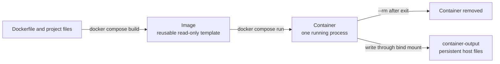

# Docker and container guide

This guide starts with two tiny examples, then runs the real DEM Crack Surface
Mesher without using Python from the host computer. The same project image runs
through Docker Desktop on Windows (in Linux-container mode) and Docker Engine
on Linux.

> **Supported container scope:** headless, source-free Python validation,
> meshing, reconstruction, and characterization. The Tk desktop interface,
> Cast3M/FISS, and the external Gmsh viewer remain native workflows because
> they depend on a host display or separately installed software.

## 1. Image, container, and mount



| Term | Meaning in this project |
|---|---|
| Image | A packaged Python 3.11 environment, dependencies, and project source. |
| Container | A disposable execution of that image. It is a process, not a second computer. |
| Bind mount | A host directory made visible inside the container. It keeps results after `--rm`. |
| Compose | The `compose.yaml` recipe that remembers the image, user, and output mount. |

Docker isolates the application dependencies. It does not emulate the host
operating system and it does not include Cast3M, Gmsh, or a desktop display.

## 2. Install and verify Docker

- Windows: install [Docker Desktop for Windows](https://docs.docker.com/desktop/setup/install/windows-install/), use the WSL 2 backend, and select **Linux containers**.
- Linux: install [Docker Engine](https://docs.docker.com/engine/install/) and the [Docker Compose plugin](https://docs.docker.com/compose/install/linux/).

Open a new terminal and verify both components:

```console
docker version
docker compose version
```

`docker version` must show both a Client and a Server. If only the Client is
shown, start Docker Desktop or the Docker daemon.

## 3. Two small learning examples

### Example A: create and remove a tiny container

```console
docker run --rm hello-world
```

Docker downloads an image, creates a container, runs its command, prints the
message, and removes the stopped container because of `--rm`.

### Example B: use Python without installing Python on the host

```console
docker run --rm python:3.11-slim-bookworm python --version
```

The printed Python version comes from the container image. A broken or missing
host `python.exe` cannot change this command.

## 4. Build and run this project

Run every command below from the cloned branch root (the directory containing
`Dockerfile` and `compose.yaml`).

Build the reusable local image:

```console
docker compose build
```

Show the containerized command help:

```console
docker compose run --rm mesher
```

Validate the documented constant-surface case without generating a mesh:

```console
docker compose run --rm mesher --headless examples/docker/constant-planes.ini --validate-only
```

Run the complete source-free example:

```console
docker compose run --rm mesher --headless examples/docker/constant-planes.ini
```

The example's configured `_runtime` directory is mounted to
`container-output` on the host, so its BDF, report, and preview files survive
container removal.

```mermaid
sequenceDiagram
    participant H as Windows or Linux host
    participant D as Docker
    participant P as Containerized Python mesher
    participant O as container-output
    H->>D: docker compose run --rm mesher ...
    D->>P: start image with isolated Python 3.11
    P->>P: load INI, validate surfaces, build mesh
    P->>O: write through /app/_runtime mount
    P-->>D: exit status 0 or diagnostic
    D-->>H: remove container; keep output files
```

## 5. Run your own case

Put `run.ini` and its relative input files in a directory named `my-case`.
Set its `workdir` to an absolute container path such as `/output/my-case`.
First create the output directory on the host.

PowerShell:

```powershell
New-Item -ItemType Directory -Force .\container-output | Out-Null
docker run --rm `
  --mount "type=bind,source=$($PWD.Path)\my-case,target=/case,readonly" `
  --mount "type=bind,source=$($PWD.Path)\container-output,target=/output" `
  dem-crack-surface-mesher:local `
  --headless /case/run.ini --validate-only
```

Bash:

```bash
mkdir -p container-output
docker run --rm \
  --user "$(id -u):$(id -g)" \
  --mount "type=bind,source=$(pwd)/my-case,target=/case,readonly" \
  --mount "type=bind,source=$(pwd)/container-output,target=/output" \
  dem-crack-surface-mesher:local \
  --headless /case/run.ini --validate-only
```

Remove `--validate-only` only after validation succeeds. Read-only input and a
separate writable output mount prevent the container from modifying case data.

## 6. What the project files do

- `Dockerfile` starts from Linux Python 3.11, installs the recorded dependency
  constraints, verifies the six protected runtime files, compiles the Python
  source, and changes to an unprivileged numeric user.
- `.dockerignore` removes Git metadata, virtual environments, caches, and local
  results from the build context.
- `compose.yaml` builds the image and mounts `container-output` at the example
  runtime location. It does not use privileged mode or mount the Docker socket.
- `.github/workflows/ci.yml` builds the image and runs help, validation, and
  the complete minimal source-free mesh on an Ubuntu runner.

The image is built locally; this repository does not require users to trust a
prebuilt project image from an external registry.

## 7. Useful commands

| Goal | Command |
|---|---|
| Rebuild after source changes | `docker compose build` |
| Refresh the Python base image | `docker compose build --pull` |
| Show project help | `docker compose run --rm mesher` |
| Validate Compose syntax | `docker compose config --quiet` |
| List local project images | `docker image ls dem-crack-surface-mesher` |
| List running containers | `docker container ls` |

## 8. Troubleshooting

**`docker` is not recognized**

Install Docker using the official links above, then open a new terminal. Docker
is not included with this repository or with Conda.

**Cannot connect to the Docker daemon**

Start Docker Desktop on Windows or the Docker service on Linux. Re-run
`docker version` and confirm that the Server section appears.

**Windows reports an incompatible image or container mode**

This is a Linux image. Switch Docker Desktop to Linux containers; do not select
Windows-container mode.

**Linux cannot write `container-output`**

Pass the host identity to Compose:

```bash
HOST_UID="$(id -u)" HOST_GID="$(id -g)" \
  docker compose run --rm mesher --headless examples/docker/constant-planes.ini
```

**The desktop window does not open**

That is intentional in the container. Use the branch's native setup for the Tk
workbench and external viewers, or use `--headless` in Docker.

**A host Python error still appears**

Confirm that the command begins with `docker` or `docker compose`. Container
commands do not call the host `python`, `python3`, or `py` launchers.
