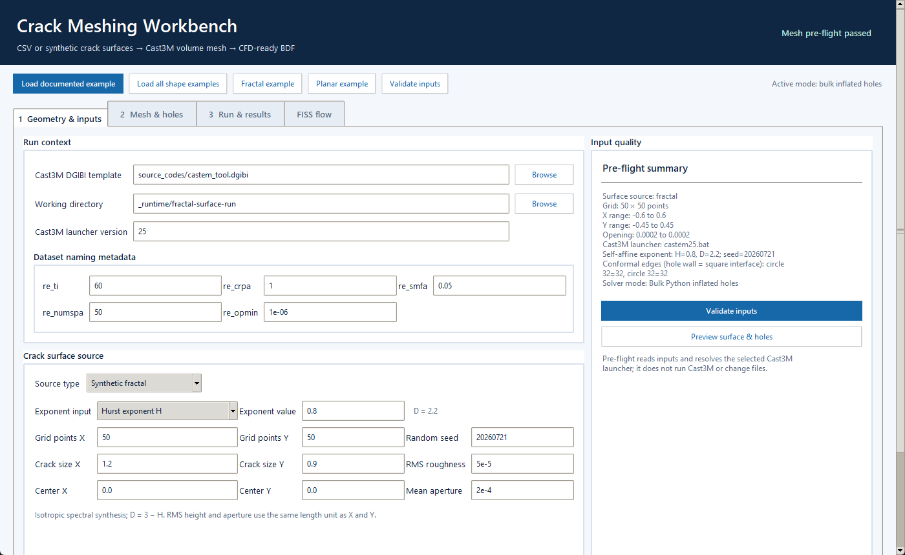

# Scientific Workbench

`castem_pipeline_gui_scientific.py` is the single launcher for the enhanced workflow. It adds a clearer scientific interface and the accelerated bulk-hole implementation without editing the immutable T13 GUI or its Cast3M templates.

Run it without arguments for the interactive workbench, or pass `--headless CONFIG` to execute the same scientific pipeline from an INI file without creating a Tk window.

The animated walkthrough in the main README and both workbench screenshots can be recaptured from the real interface with `python scripts\capture_scientific_ui.py`. Published path fields are converted to repository-relative values before capture.

## Workflow

1. Open the workbench and select **Load documented example**, **DEAP fitting
   example**, **Fractal example**, or **Planar example**; alternatively select
   the DGIBI template, a dedicated working directory, and define the source
   manually. The DEAP action loads the bundled `1_simple` raw-HDF5 case and
   its validated fit parameters.
2. Choose **CSV files**, **Fit DEAP results (Python)**, **Synthetic fractal**,
   or **Constant Z planes**. The five dataset naming fields are editable only
   for DEAP fitting. CSV mode derives and cross-checks them from the four
   filenames and displays them read-only; generated modes keep the established
   disabled defaults.
3. Use **Validate inputs** to check matrices or generated parameters, wall ordering, and hole topology.
4. Use **Preview surface & holes** to inspect the XY topology together with the real lower and upper three-dimensional walls before a run.
5. In **Mesh & holes**, choose one mode:
   - **Original T13 hole workflow — reference** preserves the original Cast3M construction, interpolation, and displacement behavior.
   - **Bulk Python hole mesh — fast + inflated** vectorizes the common interpolation path, writes complete lower/upper/mean `CQUAD4` fill meshes, and lets Cast3M read them with `LIRE 'NAS'`.
6. Set `num_el_fill` for the radial cell count and `re_fact_hole` for the outermost-to-hole-adjacent width ratio.
7. In **Run & results**, validate again and launch Cast3M. The live solver log and run state are streamed without blocking the interface.
8. Use **Open generated mesh in Gmsh** to open the exact combined BDF for the current naming parameters, the newest combined BDF, or the volume BDF without rerunning Cast3M.

The no-hole path remains the preserved baseline regardless of the selected hole mode. The previous `castem_pipeline_gui_python_holes.py` entry point is retained only as a compatibility wrapper and redirects to this workbench.

Changing a tracked path or parameter marks the validation state as stale. Mesh and FISS launches are mutually exclusive, and both buttons remain disabled until the active process finishes. Before a mesh run, prior fixed-name solver artifacts in the selected directory are moved to `_previous_mesh_runs`; after return code `0`, the workbench checks the expected volume and surface files before declaring the run verified.

When **Export STL surfaces** is selected, the generated DGIBI source comments
out the native Cast3M STL block. After Cast3M has successfully written the
boundary BDF files, Python exports the lower, upper, mean, side, and hole
surfaces as high-precision ASCII STL. It reports and omits only exactly
zero-area BDF triangles, avoiding Cast3M error 808 and binary-STL precision
loss.

## Generated surfaces

DEAP mode reconstructs the selected connected crack component from
`deap_post.h5` and `deap_output.h5`, then evaluates both faces with the
MATLAB-compatible two-dimensional quadratic LOESS port. The naming metadata
fields supply time step, component, span, grid resolution, and opening
threshold. Select the crack-plane orientation and displacement magnification;
provide a six-value bounding box only when `input.boundary` is absent. The fit
writes its four matrices and `deap-fit-report.json` under
`_generated_surface_inputs` before entering the same Cast3M path.

The fractal mode implements an isotropic Gaussian self-affine surface through spectral filtering. Enter either the Hurst exponent `H` or the graph dimension `D`; the interface displays the coupled value using `D = 3 - H`. Grid point counts, physical X/Y dimensions, RMS height, mean aperture, and an integer seed complete the definition. The walls share the same rough mean surface and remain separated by a constant aperture, preventing intersections.

Constant mode creates two planar grids. It supports a lower surface fixed at `z = 0`, as in the documented example, but requires a strictly higher upper surface for non-zero volume. During execution all generated modes write four runtime CSV matrices and then use the same hole, Cast3M, merge, FISS, and Gmsh paths as imported CSV data.



See the [DEAP fitting guide](deap-surface-fitting.md), [four DEAP application examples](../examples/deap/README.md), and [generated surface examples](../examples/surfaces/README.md) for complete GUI-free configurations and verification evidence.

## Inflation behavior

The bulk mode constructs every radial ring explicitly before writing the BDF. The live normalized profile in the hole panel previews those cell edges. With `num_el_fill=5` and `re_fact_hole=5`, it produces five cells whose widths grow geometrically away from the hole, with a measured outermost/hole-adjacent ratio of `4.99999988` after Cast3M import in the documented test.

Angular subdivisions follow `nelem_x` and `nelem_y` edge by edge. For example, refinement 2 produces 64 square-interface edges and 64 circular edges per hole; it does not leave a 32-to-64 hanging-node transition.

Each row offers `circle`, `rectangle`, `triangle`, or `regular_polygon`. Its visible fields change to radius; width/height/rotation; side length/rotation; or sides/circumradius/rotation. **Load all shape examples** populates one validated example of each. Polygonal shapes require bulk Python mode; reference mode and FISS remain circle-only.

See [Bulk inflated hole meshing](python-hole-interpolation.md) for the algorithm and [Provisional verification](provisional-verification.md) for the real integration, orientation, and timing evidence.

## FISS

The **FISS flow** tab retains the same configured input variables and invokes the baseline FISS execution/post-processing methods. It is separated from the primary mesh workflow because it is a second Cast3M calculation, not a mesh-export option.

## Mesh comparison

The **Open mesh comparison** action opens the refinement-2 conformality comparison at `docs/assets/mesh-comparison-r2-conformal.png` when it exists. Recreate it only from independent real reference and scientific BDF outputs:

```powershell
python scripts\benchmark_hole_optimization.py --clean
python -m pip install -r requirements-visuals.txt -c constraints-baseline.txt
python scripts\render_hole_mesh_comparison.py --refinement 2 --output docs\assets\mesh-comparison-r2-conformal.png
```

To retain the already verified reference cases and rerun only the scientific cases:

```powershell
python scripts\benchmark_hole_optimization.py --reuse-baseline
python scripts\render_hole_mesh_comparison.py --refinement 2 --output docs\assets\mesh-comparison-r2-conformal.png
```

The renderer reports exported BDF cell counts and visual geometry. It does not certify numerical equivalence, physical correctness, CFD compatibility, or general mesh quality.
