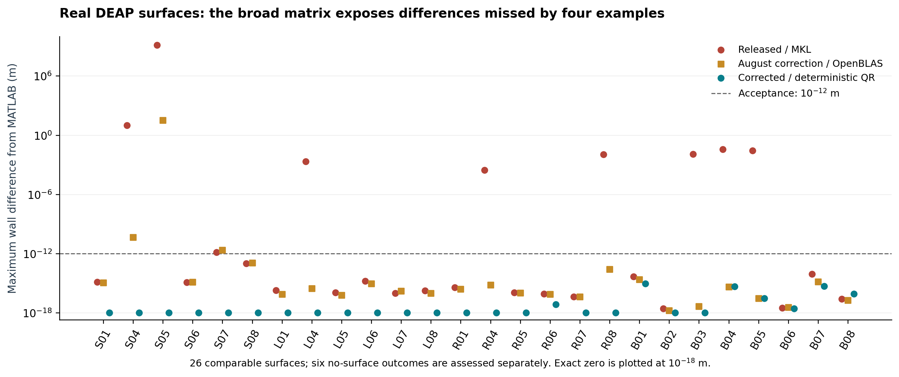

# MATLAB/Python surface and contact audit — 6 September 2026

The review found and corrected differences in surface extraction, fitting
arithmetic and contact decisions. Both platform implementations pass the frozen
MATLAB reference matrix. The comparison tolerance is unchanged at `1e-12` in
input units (metres for real DEAP surfaces); contact masks must match exactly.

- [Six-page assessment](report.pdf)
- [All 26 comparable DEAP surfaces](figures/all_deap_surfaces.pdf)
- [All 24 paired-wall contact cases](figures/all_contact_cases.pdf)
- [Findings and practical limits](review-findings.md)
- [Native Windows/Linux results and validated commits](ci-summary.json)
- [Complete local 216-case comparison](windows-portable-final.json)



The maximum real-surface error in the complete local comparison is
`8.881784197001252e-16 m`. There are no differing contact decisions, including
all 40,344 synthetic paired-wall grid decisions. Each platform version also
passes 184 fitting/contact cases on native Windows and Linux with Python 3.10
and 3.13, and all 32 real DEAP scenarios on native Linux. Five CI jobs per
platform version pass, including Docker. See the individual JSON reports under
`native/` for runtime-specific numerical errors and source hashes.

The reference was generated by Windows MATLAB R2025b Update 1 with Curve Fitting
Toolbox 25.2. Native Linux validation runs Python against that frozen reference;
it does not claim that MATLAB was run on Linux. Six scenarios intentionally
produce no surface. The 26 remaining scenarios are evaluated array by array.

Contact geometry follows MATLAB: negative raw aperture becomes zero, the lower
wall stays fixed, and the final upper wall is rebuilt from the clamped aperture.
The Python-only HEXA8 volume mesher still requires strictly positive aperture;
preflight now reports closed-contact inputs before execution. This audit does
not add a volume mesher for pinched domains. The S05 stress case produces
unphysical elevations in MATLAB itself; agreement is not physical validation.

## Reproduce the numerical validation

From the repository root, install its development requirements, obtain the
DEAP input files with Git LFS, and run:

```text
git lfs pull --include="examples/deap/**"
python scripts/validate_matlab_fitting.py --output _runtime/matlab-fitting.json
python -m pytest -q
python -m ruff check .
python scripts/verify_baseline.py
```

The frozen fixtures, their checksums and MATLAB reproduction instructions are
in [tests/data/matlab_r2025b](../../../tests/data/matlab_r2025b/README.md).
The validator checks both fixture integrity and numerical agreement.

## Reproduce the figures and report

Run these commands from this directory in an environment containing the report
dependencies. The archive contains saved MATLAB/Python arrays and the selected
historical outputs needed by the figures; regeneration does not rerun MATLAB.

```text
python -m pip install -r requirements-report.txt
python -m zipfile -e comparison-data.zip comparison-data
python build_report.py --evidence-root comparison-data
```

Outputs appear in `comparison-data/report.pdf` and `comparison-data/figures/`.
The `windows-mkl-committed` archive directory is the released-code baseline;
`windows-pip-current` is the August correction under verified OpenBLAS wheels;
`windows-portable-final-arrays` contains the corrected deterministic result.
These historical names are retained so metrics and arrays remain traceable.
The figures use common colour scales within comparisons and show numerical
residuals and exact contact masks. They are not CFD simulations.

To verify this evidence bundle from the repository root:

```text
python scripts/verify_baseline.py --root docs/validation/matlab-parity-2026-09-06 --manifest docs/validation/matlab-parity-2026-09-06/SHA256SUMS
```

Source hashes bind this evidence to the reviewed fitting implementation.
The CI links identify the tested code commits; later commits add this evidence
and documentation without changing those fitting sources. The protected-file
manifest records unchanged baseline and legacy MATLAB files on both branches.
Tested agreement is not a guarantee for every possible input or MATLAB release.
