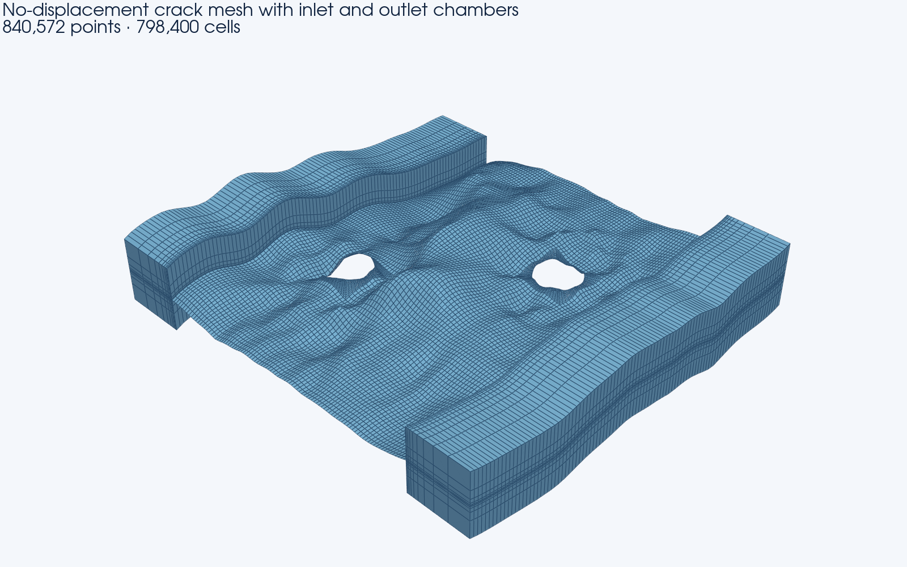
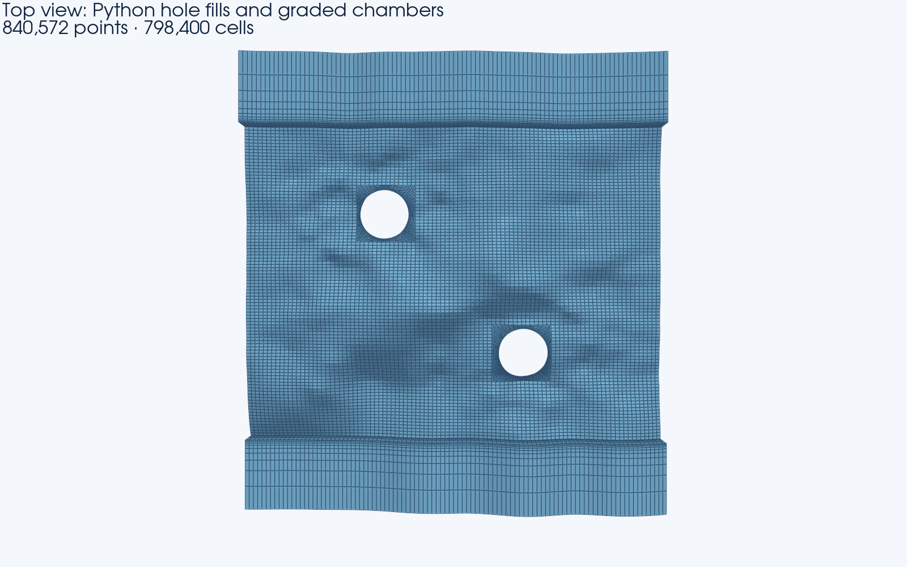

# Inlet and outlet chamber example

This example uses the real `ti60` CSV crack surface and the two circular holes
already provided in `examples/input`. It demonstrates the chamber option now
embedded in the single Scientific Workbench and headless runner. The single
`source_codes/castem_tool.dgibi` mesh source now owns all chamber construction
and conditional exports behind `opti_chamb`. The hole fills are generated
directly on the three rough surfaces by Python and imported as NASTRAN meshes;
this independent optimization replaces the expensive legacy hole-correction
calls in the generated run copy.

## Result



The inlet and outlet are attached to the crack faces at global `Ymin` and
`Ymax`. Each chamber first follows the complete crack opening over a length of
`0.20`. Its upper and lower faces are then extruded by `height / 2 = 0.10`.



The top view shows the requested grading: cells are smallest at the
crack/chamber junction and increase monotonically toward each remote boundary.

## Parameters

| Group | Parameter | Value |
|---|---|---:|
| Crack mesh | Elements in X | 2 |
| Crack mesh | Elements in Y | 2 |
| Crack mesh | Elements in Z per half | 30 |
| Crack mesh | Z inflation factor | 1.025 |
| Chamber | Inlet/outlet height | 0.20 |
| Chamber | Inlet length | 0.20 |
| Chamber | Outlet length | 0.20 |
| Chamber | Height elements, total | 10 each |
| Chamber | Length elements | 10 each |
| Chamber | Height ratio factor | 5.0 each |
| Chamber | Length ratio factor | 5.0 each |
| Holes | Circular holes | `(-0.20, 0.20, 0.07)` and `(0.20, -0.20, 0.07)` |
| Holes | Radial elements | 15 |
| Holes | Nodes per imported surface | 2,048 |
| Holes | Quadrilaterals per imported surface | 1,920 |

The height-element count is the total added count and must be positive and
even. It is divided equally between the upper and lower half-height
extrusions. Dimensions use the same unit as the input CSV coordinates.

## Reproduce the example

The preferred single-launcher headless reproduction is:

```powershell
python.exe .\castem_pipeline_gui_scientific.py --headless .\examples\chambers\run.ini --validate-only
python.exe .\castem_pipeline_gui_scientific.py --headless .\examples\chambers\run.ini
```

For the interactive path, run
`python.exe .\castem_pipeline_gui_scientific.py`, click **Chamber example**,
review the embedded chamber controls, and run the converter.

The headless launcher is the reproducible non-interactive route. It reads the
one mesh source, patches native `opti_chamb=1` and its scalar values,
materializes the three Python hole-fill BDFs, writes the generated DGIBI into
the configured working directory, and then calls Cast3M. Python does not
generate or inject the chamber geometry.

The run writes the combined volume, complete exterior and separate inlet and
outlet volumes. Each chamber also has independent `all`, `interface`, `outer`,
`top`, `bottom`, `xmin` and `xmax` surface BDF files.
With STL export enabled, Python converts those named chamber boundaries through
the same high-precision BDF-to-STL path used for the crack and hole surfaces.

The reviewed numerical checks are recorded in
[`validation-summary.json`](validation-summary.json). The three compact
Python-generated hole-fill BDF inputs used for the reviewed validation are
included for audit and comparison; the launcher regenerates them during a new
run. The complete generated volume and boundary BDF outputs are intentionally
excluded from Git because they occupy several gigabytes.

The integrated `run.ini` execution also returned Cast3M error level `0`, found
no missing expected outputs, wrote the 198,524,672-byte merged BDF, and safely
converted 24 crack/hole/chamber STL files containing 392,920 triangles. No
exactly degenerate triangle had to be omitted. Its 177,009,121-byte volume BDF
has the same SHA-256 as the mesh used for the documented topology, partition,
and Jacobian checks.
